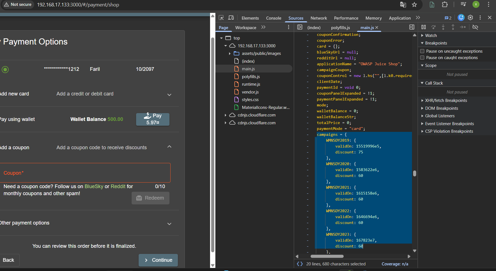
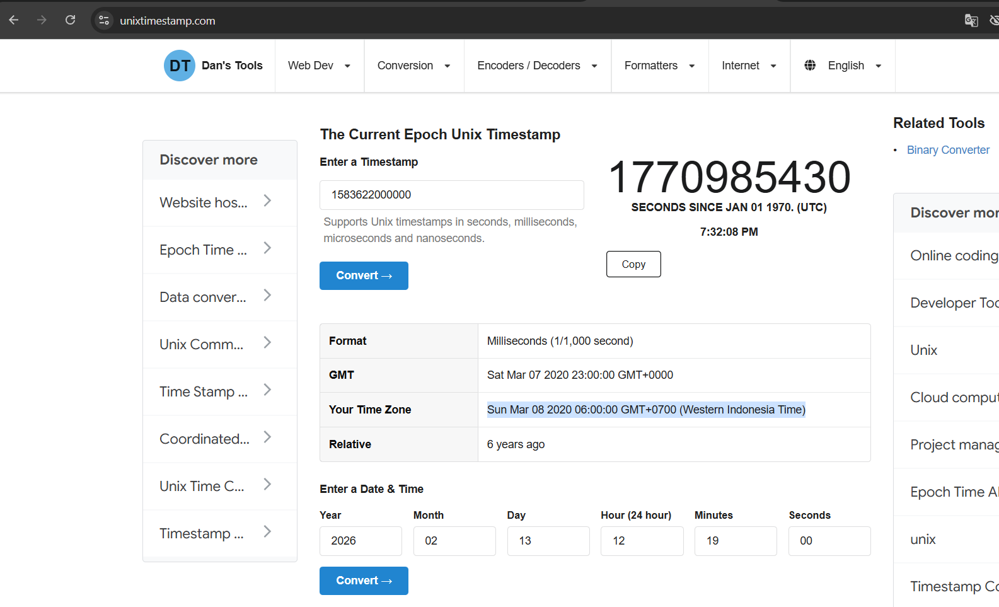
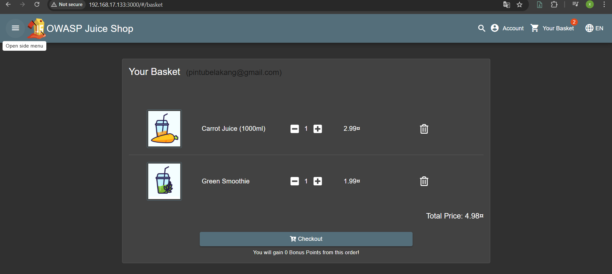
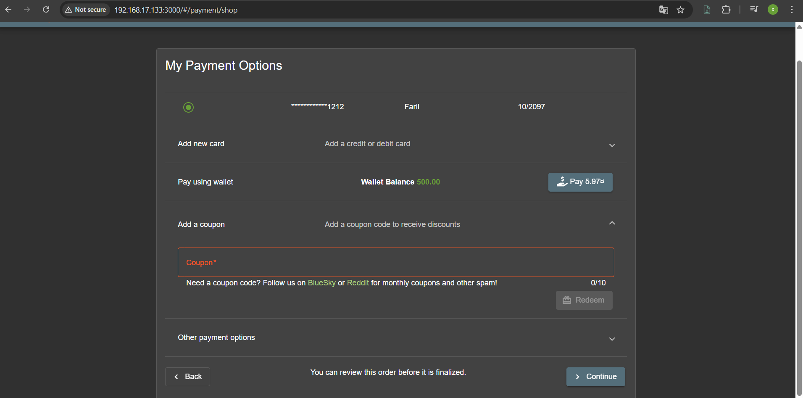
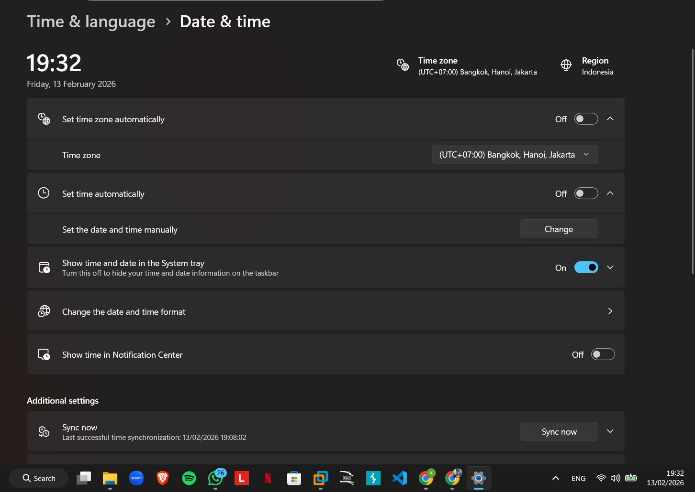
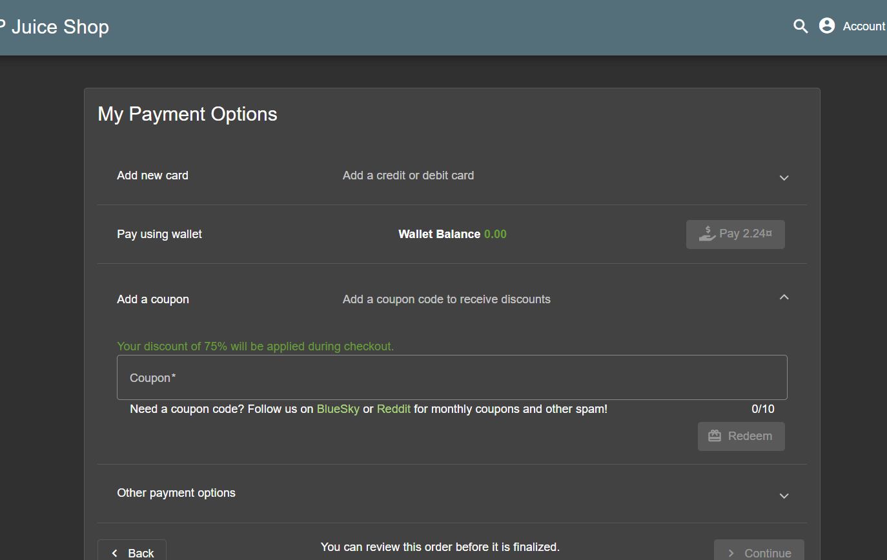
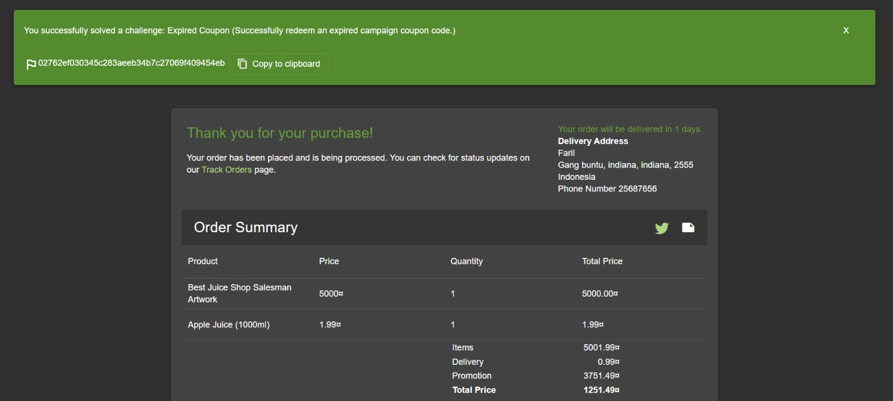

# Challenge: Expired Coupon

### Description
Toko ini membuang diskon lamanya ke tong sampah karena dianggap sudah busuk dimakan waktu. Namun mesin kasirnya tidak punya hidung untuk mencium bau itu. Pungut kembali kode yang telah mati, dan suapkan paksa ke mulut sistem.

### Hint
* Kode kupon lama masih tertinggal di dalam source code JavaScript (`main.js`).
* Validasi kedaluwarsa (`validOn`) bergantung pada waktu di perangkat pengguna (Client-Side).
* Sistem dapat dikelabui dengan memanipulasi tanggal sistem operasi ke masa lalu (Time Travel).

---

### Analysis
Kami melakukan inspeksi pada source code (`main.js`) dan menemukan objek `campaigns` yang berisi kode kupon `WMNSDY2019`. Di sana terlihat properti `validOn` dengan nilai timestamp unix.

Kami mengonversi timestamp tersebut menggunakan Unix Timestamp Converter. Ditemukan bahwa kode tersebut valid pada bulan **Maret** (tahun 2019/2020).

---

### Solution

**1. Persiapan**
Pertama, kami memasukkan beberapa barang ke dalam keranjang belanja.

Kemudian kami menuju halaman pembayaran. Di sini terdapat kolom untuk memasukkan kode kupon.

**2. Eksploitasi (Time Travel Attack)**
Karena validasi tanggal aplikasi ini bergantung pada waktu perangkat pengguna, kami melakukan serangan manipulasi waktu.

Kami menonaktifkan fitur *Set time automatically* pada Windows dan mengubah tanggal sistem mundur ke tahun saat kupon masih berlaku.

**3. Hasil**
Setelah waktu diubah, kami me-refresh halaman pembayaran dan memasukkan kode kupon `WMNSDY2019`.

Sistem menerima kupon tersebut dan memberikan diskon besar (75%) karena menganggap hari ini masih dalam periode promo.

**Bukti Sukses (Flag):**

